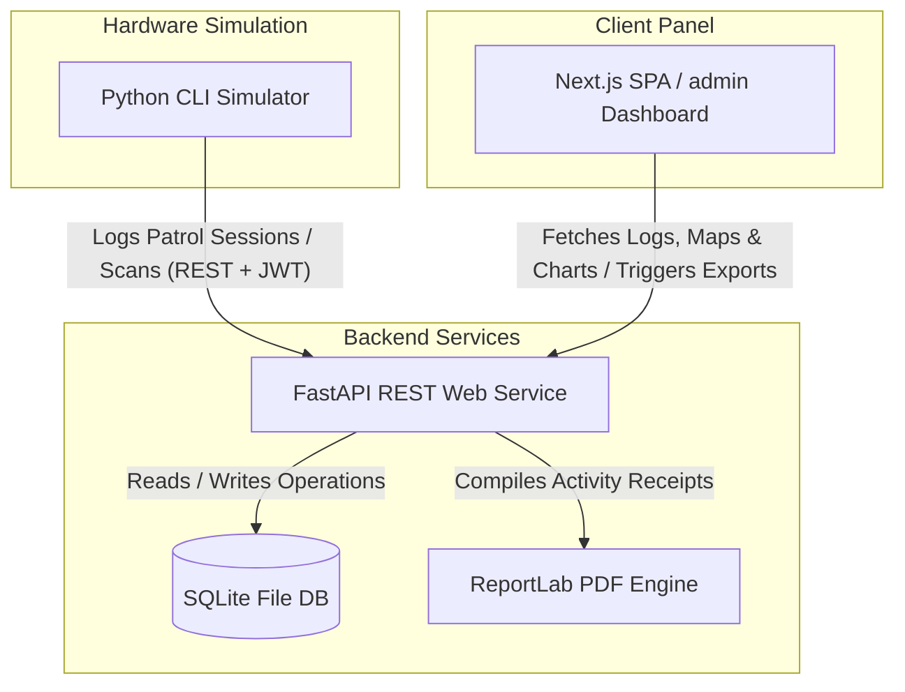
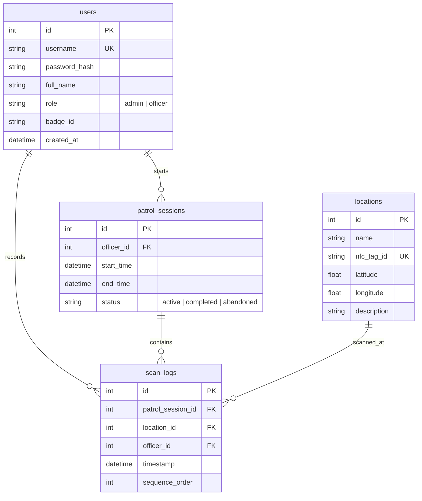

# System Architecture — NFC-Based Security System

This document outlines the architecture, database models, API services, and data flows of the NFC-based security patrol tracking system.

---

## 🏗️ System Overview

The system is structured as a vertical-slice decoupled workspace split into three units:

---

## 🗄️ Database Schema & Object Relations

The system stores logs using SQLite (`security_logger.db`) managed via SQLAlchemy ORM.

---

## 🔒 Security & Session Flow

### Authentication Guarding
*   **Algorithm**: HMAC-SHA256 (HS256) signature encryption.
*   **Password Hashing**: Raw `bcrypt` (using `bcrypt.hashpw` with a secure default work factor salt, bypassing `passlib` to ensure runtime longevity).
*   **JWT Handshake**:
    1.  The client issues a POST containing credentials to `/api/auth/login`.
    2.  The server verifies matching credentials in SQLite databases and returns a JWT claim payload containing the token and user data details.
    3.  Admin dashboards insert this JWT inside Axios request headers (`Authorization: Bearer <token>`) using client-side HTTP request interceptors.

---

## 📡 API Routing Specification

### Authentication
*   `POST /api/auth/login` → Handles authentication and returns JWT tokens to officers and supervisors.

### Patrol Workflows (Officer Role)
*   `GET /api/patrol/active` → Retrieves active patrol session details if one is in-progress.
*   `POST /api/patrol/start` → Initiates a new patrol session. Raises `400` if another patrol is currently active.
*   `POST /api/patrol/scan` → Enrolls a checkpoint scan. Increases sequence count by one.
*   `POST /api/patrol/end` → Concludes active sessions and flags them as `completed`.

### Supervisor Operations (Admin Role)
*   `GET /api/logs` → Queries checkout events log rows with filtering rules support.
*   `GET /api/patrol/sessions` → List summaries of all historical sessions.
*   `GET /api/patrol/map-data/{session_id}` → Returns chronological sequence coordinates for Leaflet lines player mapping.
*   `GET /api/analytics` → Aggregates statistics: patrols frequency, officer leaderboards, and missed tag warnings.
*   `GET /api/reports/csv` and `/api/reports/pdf` → Downloads customized patrol activity records.
